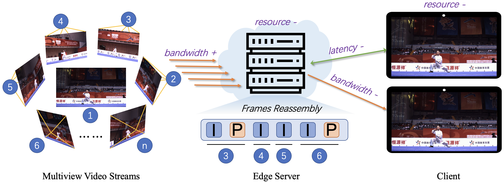

# VARFVV: View-Adaptive Real-Time Interactive Free-View Video Streaming with Edge Computing (JSAC 2025)

This is official code for [VARFVV: View-Adaptive Real-Time Interactive Free-View Video Streaming with Edge Computing](https://arxiv.org/abs/2501.13630) (JSAC 2025)

**[Qiang Hu](https://qianghu-huber.github.io/qianghuhomepage/), Qihan He, [Houqiang Zhong](https://medialab.sjtu.edu.cn/author/houqiang-zhong/), [Guo Lu](https://guolusjtu.github.io/guoluhomepage/), [Xiaoyun Zhang](https://mediabrain.sjtu.edu.cn/xiaoyun-zhang/), [Guangtao Zhai](http://multimedia.sjtu.edu.cn/), Yanfeng Wang.** 

[[Project Page]](https://waveviewer.github.io/VARFVV/) [[Paper Link]](https://arxiv.org/abs/2501.13630) [[Dataset Link]](https://github.com/qianghu-huber/VARFVV_Dataset)



Code will be released soon.

## Citation

```
@ARTICLE{10960681,
  author={Hu, Qiang and He, Qihan and Zhong, Houqiang and Lu, Guo and Zhang, Xiaoyun and Zhai, Guangtao and Wang, Yanfeng},
  journal={IEEE Journal on Selected Areas in Communications}, 
  title={VARFVV: View-Adaptive Real-Time Interactive Free-View Video Streaming with Edge Computing}, 
  year={2025},
  volume={},
  number={},
  pages={1-1},
  keywords={Streaming media;Bandwidth;Servers;Switches;Bit rate;Streams;Quality of experience;Video recording;Quality assessment;Delays;free-view video;view-adaptive streaming;QoE;bit allocation;computational complexity;real-time},
  doi={10.1109/JSAC.2025.3559140}
}
```
